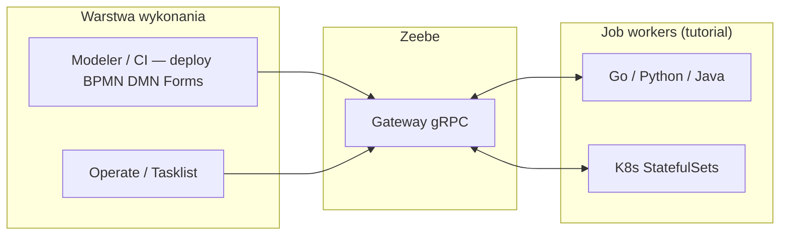

# Camunda 8 — repozytorium szkoleniowe

[](https://github.com/OlehKondratow/camunda8-tutorial/actions/workflows/ci.yml)
[](LICENSE)
[](zeebe-tutorial/go.mod)

**Cel:** materiał praktyczny do Camundy **8** — **Zeebe job workers** (gRPC), BPMN/DMN/formularze, lokalny **Docker Compose** oraz ścieżka do **GKE** i **Cloud Build** (bez zastępowania oficjalnej dokumentacji Camundy).

Repozytorium nadaje się jako **referencja techniczna** (portfolio, onboarding zespołu). To **nie** produkcyjna dystrybucja platformy; parametry bezpieczeństwa są uproszczone pod lab — zob. [SECURITY.md](SECURITY.md).

**Źródło:** [github.com/OlehKondratow/camunda8-tutorial](https://github.com/OlehKondratow/camunda8-tutorial)

## Spis treści

- [Model logiczny](#model-logiczny)
- [Wymagania](#wymagania)
- [Struktura repozytorium](#struktura-repozytorium)
- [Szybki start (lokalnie)](#szybki-start-lokalnie)
- [Proces i narzędzia operatorskie](#proces-i-narzędzia-operatorskie)
- [Chmura (GCP / GKE)](#chmura-gcp--gke)
- [Powiązane projekty](#powiązane-projekty)
- [Kontrybucja i polityki](#kontrybucja-i-polityki)

## Model logiczny



- **Camunda 8 / Zeebe** (vs Camunda 7): orchestracja przez **zewnętrzne job workers**, nie przez „silnik w JVM aplikacji”.
- **Service Task** mapuje na **job type** (`c8jw-*`): worker aktywuje zadanie, wykonuje logikę, **complete** ze **zmiennymi** — te same nazwy typów w BPMN, Kubernetes i kodzie.
- **Operate / Tasklist**: podgląd instancji i zadań użytkownika po stronie platformy.
- **Pełna ścieżka** formularz + DMN + BPMN: [zeebe-tutorial/bpmn-and-dmn-bundles.md](zeebe-tutorial/bpmn-and-dmn-bundles.md), m.in. proces **`c8jw_credit_orchestration`**.
- **Compose** uruchamia broker + gateway + kontenery workerów; szczegóły w [docker-compose.yaml](docker-compose.yaml).

Typowy scenariusz weryfikacji: Zeebe + worker → deploy procesu → start instancji w **Operate** → job → zmienne i przejście na diagramie.

**Dwa job types pod rząd:** [zeebe-tutorial/bpmn/examples/portfolio-pipeline.bpmn](zeebe-tutorial/bpmn/examples/portfolio-pipeline.bpmn) (`c8jw-portfolio-pipeline`). Przy starcie instancji ustaw zmienne, np. `{"name":"Alice","amount":1500}` — inaczej krok **c8jw-golang** zgłosi błąd (logika: [zeebe-tutorial/internal/tutorial/decision_task.go](zeebe-tutorial/internal/tutorial/decision_task.go)).

## Wymagania

| Komponent | Wersja / uwagi |
|-----------|----------------|
| Docker / Podman | Compose v2 do lokalnego stacku |
| Go | 1.21+ — worker w `zeebe-tutorial/` |
| Python | 3.12 — przykłady w `kubernetes/*-demo-worker/`, `zeebe-tutorial/python/` |
| Java | 21 — `kubernetes/java-example-worker` (Maven) |
| GCP (opcjonalnie) | `gcloud`, dostęp do GKE, Artifact Registry — [docs](docs/gke-camunda-cheatsheet.md) |

Zmienne środowiskowe Go workera: szablon [zeebe-tutorial/.env.example](zeebe-tutorial/.env.example).

## Struktura repozytorium

| Ścieżka | Rola |
|---------|------|
| `zeebe-tutorial/` | Worker Go (`cmd/example-worker`), formularze i BPMN; przewodnik zbiorczy: **`bpmn-and-dmn-bundles.md`**; m.in. credit orchestration, DMN `complex-decision-tree`, worker-picker |
| `docker-compose.yaml` | Lokalny **Zeebe 8.5** + worker images |
| `kubernetes/` | StatefulSet’y szkoleniowych workerów ([kubernetes/README.md](kubernetes/README.md)) |
| `ci/cloudbuild-workers.yaml` | Cloud Build → Artifact Registry |
| `scripts/deploy-workers-to-gke.sh` | Wdrożenie do namespace `c8-tutorial-workers` |
| `helm/` | Wartości użytkownika Camundy + [helm/README.md](helm/README.md), `scripts/fetch-helm-values.sh` |
| `docs/gke-camunda-cheatsheet.md` | GKE, Helm, port-forward, PVC |
| `docs/service-tasks-and-gateways-reunico.md` | Service tasks / bramy |
| `examples/` | Dodatkowy BPMN, przykładowy formularz |
| ~~`credit-scoring-camunda/`~~ | **Wyłączone z tego klonu** — osobne repozytorium / katalog (np. ML + Python workers); dokumentacja u źródła projektu |

## Szybki start (lokalnie)

```bash
git clone https://github.com/OlehKondratow/camunda8-tutorial.git
cd camunda8-tutorial
docker compose up --build
```

- Gateway gRPC: **`127.0.0.1:26500`** (plaintext w labie).
- Domyślnie nasłuchują typy **`c8jw-golang`** i **`c8jw-python`**.

**Worker Go z hosta** (zamiast kontenera):

```bash
cd zeebe-tutorial
cp -n .env.example .env   # opcjonalnie; wyeksportuj ZEEBE_ADDRESS
export ZEEBE_ADDRESS=127.0.0.1:26500
go run ./cmd/example-worker
```

Opcja **`JOB_TYPES`** (comma-separated), np. `JOB_TYPES=c8jw-golang` — zob. [zeebe-tutorial/cmd/example-worker/main.go](zeebe-tutorial/cmd/example-worker/main.go).

**Worker Python:** [zeebe-tutorial/python/example-zeebe-worker/README.md](zeebe-tutorial/python/example-zeebe-worker/README.md).

**Przykładowe BPMN:** [zeebe-tutorial/bpmn/examples/example-task.bpmn](zeebe-tutorial/bpmn/examples/example-task.bpmn) (`example-task-process`), łańcuch **Python → Go:** [portfolio-pipeline.bpmn](zeebe-tutorial/bpmn/examples/portfolio-pipeline.bpmn). Diagram z kursu / szkolenia: [examples/diagram_1.bpmn](examples/diagram_1.bpmn) — ewentualnie wdrożyć ręcznie w Modelerze (Type **`c8jw-golang`** na gałęzi automatycznej).

W **Modelerze** pole **Type** w Service Task musi być zgodne z konwencją **`c8jw-*`** z [kubernetes/README.md](kubernetes/README.md). **Process ID** jest niezależny od wdrożenia konkretnego obrazu workera.

## Proces i narzędzia operatorskie

1. Wdróż **BPMN** (i ewentualnie **DMN**, **formularze**) — Modeler lub pipeline.
2. Upewnij się, że worker (Compose / pod / binarka) ma aktywny **job type** z diagramu.
3. Uruchom instancję procesu, w Operate sprawdź postęp i zmienne.
4. Dla scenariuszy z formularzem użytkownika — **Tasklist** i powiązany **formKey**.

## Chmura (GCP / GKE)

- Ściąga operacyjna: [docs/gke-camunda-cheatsheet.md](docs/gke-camunda-cheatsheet.md)
- Build obrazów: `gcloud builds submit --config=ci/cloudbuild-workers.yaml --project=<PROJECT_ID> .`
- Wdrożenie workerów: `./scripts/deploy-workers-to-gke.sh` — repozytorium obrazów i IAM: [kubernetes/README.md](kubernetes/README.md)

## Powiązane projekty

- **Credit scoring + Camunda 8** (wyodrębniony szkielet: regresja logistyczna, workery Python, BPMN/DMN) — utrzymywany poza tym repozytorium; po sklonowaniu dodaj sąsiedni katalog według własnej konwencji.

## Kontrybucja i polityki

- [CONTRIBUTING.md](CONTRIBUTING.md) — jak przygotować PR (lokalne odpowiedniki CI).
- [SECURITY.md](SECURITY.md) — scope labu i zgłaszanie problemów.
- **Licencja:** [LICENSE](LICENSE) (MIT).
